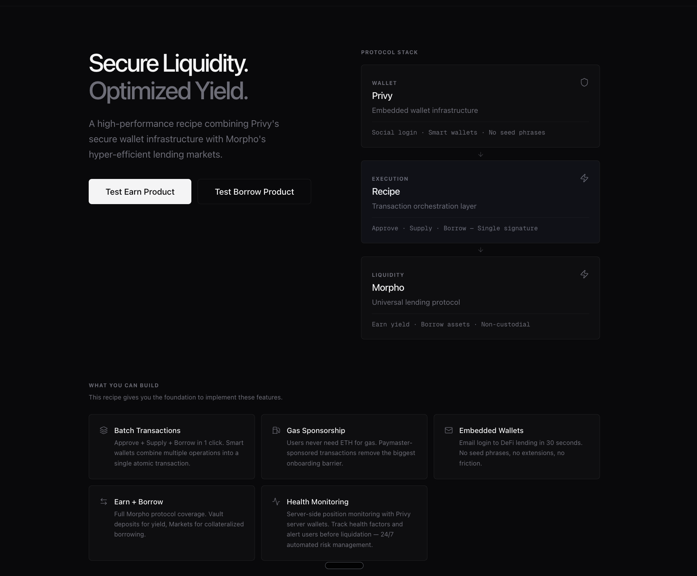
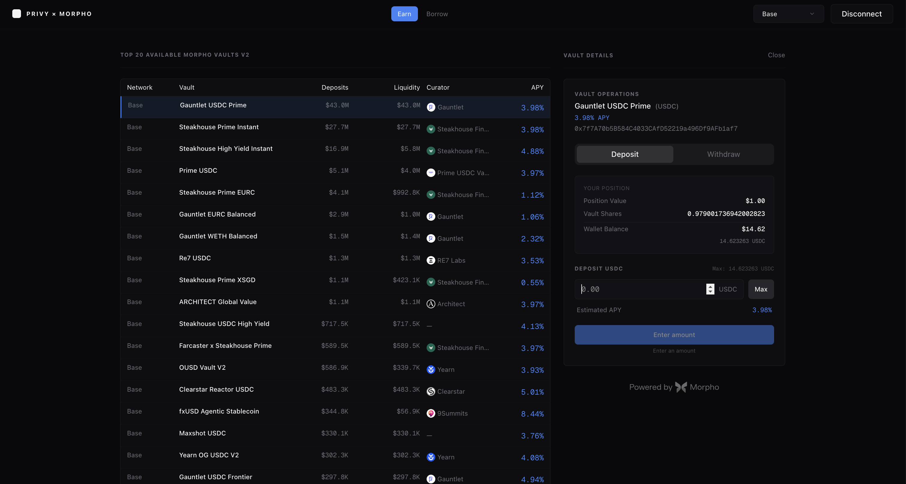
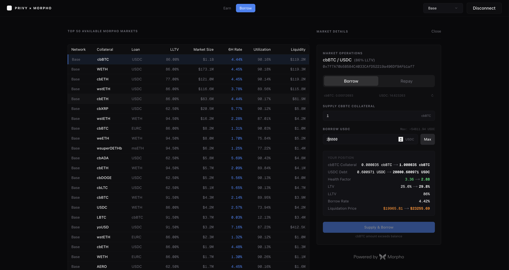

# Privy x Morpho: DeFi Lending Recipe



A developer recipe for building **Earn** and **Borrow** products using [Privy](https://privy.io) embedded wallets and [Morpho](https://morpho.org) lending markets. Clone, configure, ship.

## Disclaimer

This is an **educational demonstration** showcasing integration patterns between Privy and Morpho. It is functional but intended for learning purposes. **Do not use in production without security audits, testing, and risk assessment.**

- Always exercise caution when interacting with real smart contracts and funds
- Always use minimal amounts
- Never Hardcode any private keys 
- Consider professional security audits for production applications

## Overview

This recipe demonstrates how to build a **one-click DeFi lending application** combining:

- **[Privy](https://privy.io)** — Embedded wallet infrastructure for seamless user onboarding
- **[Morpho](https://morpho.org)** — Hyper-efficient lending markets and vault yield optimization
- **Multi-chain discovery** — Browse Morpho deployments on Ethereum, Base, Arbitrum, Polygon, Optimism, and more, with SDK-backed transaction execution currently enabled on Base

### Earn Product

Browse and deposit into Morpho vaults across chains. Real-time APY, TVL, and position tracking with value transitions on deposit/withdraw.



### Borrow Product

Browse top 50 markets, supply collateral, borrow assets. Full position simulation with LTV, health factor, liquidation price, and review step before execution.



### Key Features

- Privy wallet authentication (social login, email, or external wallet)
- Multi-vault and multi-market discovery via Morpho's GraphQL API
- Transaction building via `@morpho-org/morpho-sdk` for vault deposits/withdrawals and market borrow/repay flows
- Real-time position simulation with before/after projections
- Input validation with clear disabled reasons
- Review step before wallet execution
- Responsive split-view UI (table + action panel)

## Prerequisites

- **Node.js 20+** and **pnpm**
- **Privy App ID** from the [Privy Dashboard](https://dashboard.privy.io)
- **Basic DeFi knowledge** (ERC-20 tokens, lending markets, vaults)

## Getting Started

```bash
git clone https://github.com/morpho-org/privy-morpho-recipe.git
cd privy-morpho-recipe
pnpm install
```

Create `.env.local`:

```bash
NEXT_PUBLIC_PRIVY_APP_ID=your_privy_app_id
```

Run the development server:

```bash
pnpm dev
```

## Architecture

### Core Components

| Component | Purpose |
|-----------|---------|
| `MarketOperationsModal` | Borrow/repay panel with simulation, validation, and review step |
| `VaultOperationsModal` | Deposit/withdraw panel with value transitions and review step |
| `MarketTable` | Top 50 markets by size with rate, utilization, and liquidity |
| `VaultTable` | Top 20 vaults by TVL with APY breakdown and curator info |
| `SimulationSummary` | Before/after position projections (collateral, debt, LTV, HF) |
| `ReviewStep` | Inline transaction review before wallet execution |

### Hooks

| Hook | Purpose |
|------|---------|
| `useMarketPosition` | Borrow position state, simulation, validation, transaction handlers |
| `useVaultPosition` | Vault deposit/withdraw state, slippage detection, safety checks |
| `useMarkets` / `useVaults` | GraphQL data fetching and market/vault selection |
| `useSmartAccount` | Privy wallet integration for transaction signing |
| `useTxLifecycle` | Transaction state machine (processing, success, error) |

### Data Flow

```
Morpho GraphQL API → Apollo Client → useMarkets/useVaults hooks
                                         ↓
User selects market/vault → useMarketPosition/useVaultPosition hooks
                                         ↓
On-chain reads (viem + Morpho SDK) → Position, oracle price, market data
                                         ↓
Simulation engine → Projected LTV, HF, liquidation price
                                         ↓
Validation engine → CTA state, disabled reasons
                                         ↓
Morpho SDK action → requirements, signatures/approvals, built transaction
                                         ↓
Review step → Wallet execution via Privy wallet client
```

### Libraries

| Library | Purpose |
|---------|---------|
| `@privy-io/react-auth` | Wallet authentication and embedded wallets |
| `@morpho-org/morpho-sdk` | Recommended Morpho SDK for building VaultV2 and MarketV1 transactions, resolving approvals, Permit/Permit2 signatures, and Morpho authorizations |
| `@morpho-org/blue-sdk` | Morpho market params and offchain entity types used by the SDK flow |
| `@morpho-org/blue-sdk-viem` | Morpho contract ABIs and viem-compatible helpers |
| `@apollo/client` | GraphQL data fetching from Morpho API |
| `wagmi` + `viem` | Blockchain interactions and contract calls |
| `framer-motion` | UI animations |

## Extending This Recipe

### Adding a New Chain

The app already supports multiple chains for market and vault discovery. Current SDK-backed transaction execution is enabled on Base.

To add a new Morpho deployment:

1. Add the chain to `CHAIN_ID_MAP` in `src/context/ChainContext.tsx`
2. Add the chain config to `wagmiConfig` in `src/app/providers.tsx`
3. The GraphQL API will automatically include markets/vaults on the new chain
4. Enable the transaction handlers for that chain after validating Morpho SDK support, RPC configuration, and wallet signing behavior

### Optional Features (Not Yet Implemented)

- **Gas Sponsorship** — Privy paymaster integration for gasless transactions
- **Health Monitoring** — Server-side position monitoring with Privy server wallets
- **Batch** - Using smart wallet and batching transactions

## Security Considerations

- Morpho vaults and markets are subject to smart contract risks
- ERC-20 approvals are scoped to the specific transaction amount
- Input validation prevents unsafe positions (LTV checks, balance checks)
- Health factor simulation warns before liquidation-risk actions
- Always test with small amounts first

## Resources

- [Privy Documentation](https://docs.privy.io)
- [Morpho Documentation](https://docs.morpho.org)
- [Morpho SDK Documentation](https://docs.morpho.org/tools/offchain/sdks/morpho-sdk/)
- [Morpho SDK Source](https://github.com/morpho-org/sdks/tree/main/packages/morpho-sdk)
- [Morpho GraphQL API](https://blue-api.morpho.org/graphql)
- [Morpho App](https://app.morpho.org)

## License

MIT License — see [LICENSE](LICENSE) for details.

---

Built to demonstrate the power of Privy x Morpho integration.
